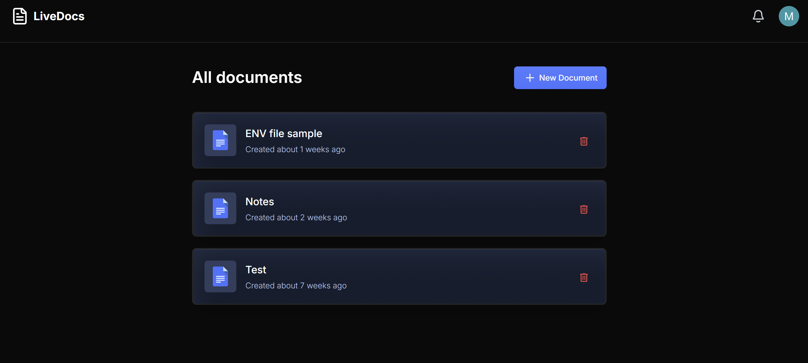
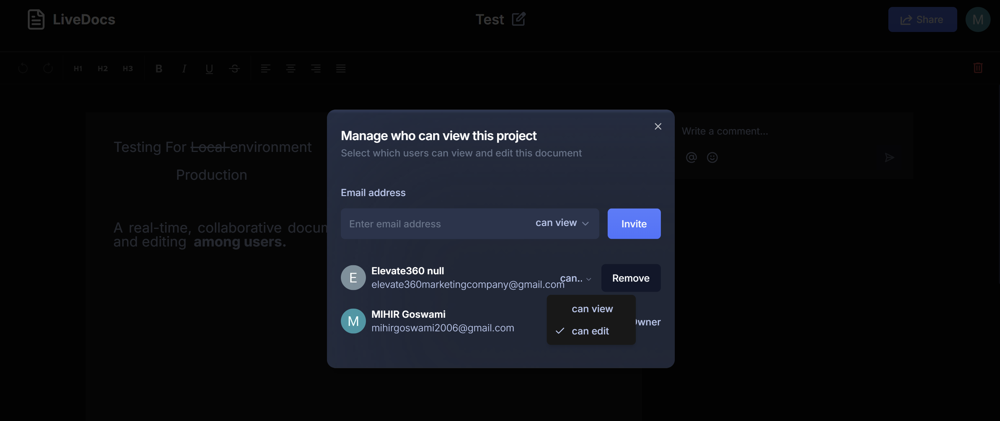
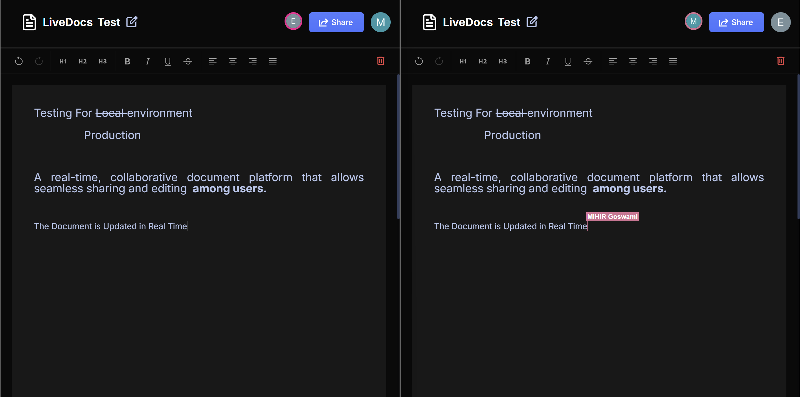

# LiveDocs

## 📋 Table of Contents

1. 🤖 [Introduction](#introduction)  
2. ⚙️ [Tech Stack](#tech-stack)  
3. ✅ [Features](#features)  
4. 🖼️ [Preview](#preview)  
5. 🤝 [Contributions](#contributions)  

<!--
6. ➤ [License](#license)  
-->

## <a name="introduction">🤖 Introduction</a>

Built with **Next.js** to handle the user interface, **Liveblocks** for real-time features, and styled with **TailwindCSS**, **LiveDocs** is a collaborative, real-time document editor, similar to Google Docs. The primary goal is to showcase the developer's ability to work in a real-time environment while creating a useful and engaging application.

If you're just getting started or encounter any bugs, join our active **Discord** community with over **34k+** members, where fellow developers can assist you!

## <a name="tech-stack">⚙️ Tech Stack</a>

- **Next.js**
- **TypeScript**
- **Liveblocks**
- **Lexical Editor**
- **ShadCN**
- **Tailwind CSS**

## <a name="features">✅ Features</a>

➤ **Authentication**: User authentication via GitHub using **NextAuth** for secure sign-in, sign-out, and session management.

➤ **Collaborative Text Editor**: Multiple users can edit the same document simultaneously, with live updates.

➤ **Document Management**:
   - **Create Documents**: Users can create and manage documents, which are automatically saved and listed.
   - **Delete Documents**: Users can delete documents they own.
   - **Share Documents**: Documents can be shared via email or link with view/edit permissions.
   - **List Documents**: View all documents owned or shared with the user, with sorting and searching options.

➤ **Comments**: Inline and general comments are supported, with threading for discussions.

➤ **Active Collaborators**: Real-time updates show active collaborators within the text editor.

➤ **Notifications**: Receive notifications about document shares, comments, and collaborator activities.

➤ **Responsive**: Fully responsive, ensuring smooth usage across all devices.

➤ And much more, including optimized code architecture and reusability.

## <a name="preview">🖼️ Preview</a>

Here are some previews of the application in action:

### Create Docs


### Share Docs


### Real-Time Document Sharing


## <a name="contributions">🤝 Contributions</a>

We welcome contributions to improve **LiveDocs**! Whether it's fixing a bug, adding a new feature, or improving documentation, your input is highly valued.

To contribute, please follow these steps:

1. Clone the repo

```bash
Git clone https://github.com/MIHIR2006/Live-Docs.git
```

2. Install dependencies

``` bash
npm install
# or
Bun install
```

3. Set up environment variables

Create a `.env.local` file in the root directory of the project and add the following environment variables:

### ENV Sample

``` bash

#Clerk
NEXT_PUBLIC_CLERK_PUBLISHABLE_KEY=
CLERK_SECRET_KEY=

NEXT_PUBLIC_CLERK_SIGN_IN_URL=/sign-in
NEXT_PUBLIC_CLERK_SIGN_UP_URL=/sign-up

# Liveblocks
NEXT_PUBLIC_LIVEBLOCKS_PUBLIC_KEY=
LIVEBLOCKS_SECRET_KEY=

# Sentry
SENTRY_AUTH_TOKEN=

```

5. Start the dev server
```bash
npm run dev
# or
Bun run dev
```

### Give it ⭐
